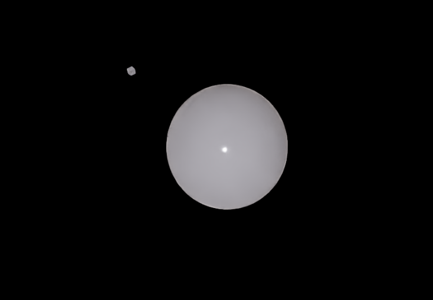

# ORBITAL MECHANICS DEMO EXTENSION (Isaac Sim 5.1)

A minimal Isaac Sim / Omniverse Kit extension that demonstrates **basic orbital mechanics** using a simple **two-body gravity model** and **RK4 integration**. The extension keeps a central body fixed and moves an orbiting body by updating its USD transform each frame.

- Central (fixed): `/World/Sphere`
- Orbiting: `/World/Cube`

## REQUIREMENTS

- NVIDIA Isaac Sim **5.1**
- Ubuntu 24.04 LTS based distro

## TO INSTALL

Install into the home directory.

```
https://github.com/sangregoriokimpo/SLI_orbit.git
```

## TO RUN:

Simply add this as an extension to Isaac Sim

```
/home/user/SLI_ORBIT/exts
```

Replace ``user`` with your username. 



